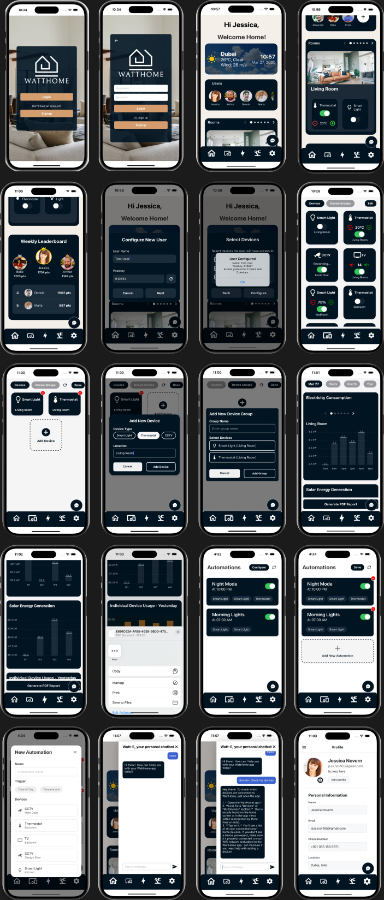

# WattHome – Smart Home device and energy management system


WattHome is a cross-platform mobile application for managing smart home devices, energy generation and usage. It enables real-time device monitoring, energy tracking, and automation scheduling. This project was developed using React Native with Expo and Firebase as the backend.

## Table of Contents

- [Features](#features)
- [Architecture Overview](#architecture-overview)
- [Technologies Used](#technologies-used)
- [Folder Structure](#folder-structure)
- [Setup Instructions](#setup-instructions)
- [Demo](#demo)
- [Contributors](#contributors)
- [License](#license)

## Features

- User authentication and session management
- Real-time device control and energy monitoring
- Support for automations (time- and temperature-based)
- Interactive energy charts and device statistics
- Multi-user access
- Real-time Firebase syncing
- Watt.E Chatbot for technical and navigation support

## Architecture Overview

**Frontend (React & Expo)**

- Developed with React Native using Expo, for iOS (15+)
- Uses TypeScript with JSX for type-safe and scalable UI development
- Expo Router for file-based navigation between screens
- Styled components for UI design consistency
- [React Native](https://reactnative.dev/)
- [Expo](https://expo.dev/)

**Backend (Firebase)**

- Firebase Authentication for secure login and user session handling
- Firestore and Realtime Database for cloud data storage
- API-driven interaction between frontend and backend
- Declarative access control rules for secure, GDPR-compliant data access
- Real-time listeners for instant UI updates
- [Firebase](https://firebase.google.com/)

## Technologies Used

**Frontend**

- `react-native`
- `expo`
- `expo-router` – Routing and screen navigation
- `react-navigation`
- `react-native-vector-icons` – UI icons
- `lucid-react-native` – Pre-built UI components
- `react-native-chart-kit` – Chart rendering for energy stats

**Backend**

- `firebase`
- `firebase-auth`
- `firebase/firestore`
- `firebase/realtime-database`

**Languages & Tools**

- TypeScript
- JavaScript (ES6+)
- Styled Components

## Prerequisites

- Node.js (v16+)
- npm (v8+)
- Xcode (for iOS development)
- Expo CLI

## Setup Instructions

1.  ⁠**⁠Clone the Repository**

    First, clone any of the project repository below from GitHub:

    ```bash
    git clone https://github.com/aha2003/smart-home-app
    ```

    ```bash
     git clone https://github.com/vaishnavi-chintha/smart-home-app
    ```

2.  ⁠**⁠Frontend Setup**

    Navigate to the frontend directory i.e watthome, remove existing dependencies, and reinstall:

    ```bash
    cd watthome
    rm -rf node_modules package-lock.json
    npm install
    ```

3.  ⁠ **⁠Running the Application**

    Once dependencies are installed, start a terminal session, and the frontend server:
    Start the Frontend Server:

    ```bash
    cd watthome
    npm start
    ```

    For web version enter w in the terminal and click enter.

    For the expo app version enter c and scan the qr code using the mobile
    iOS Version Setup (Xcode Simulator)

    ### If you want to run the iOS version on the Xcode Simulator, follow the steps below:

4.  Install Xcode
    Ensure that Xcode is installed on your Mac.

    You can download it from the Mac App Store or via the
    command line:

    ```bash
    xcode-select --install
    ```

5.  Install CocoaPods
    CocoaPods is required to install dependencies for iOS projects.

    Install it using:

    ```bash
    sudo gem install cocoapods
    ```

6.  Open the Project in Xcode
    Navigate to the iOS folder in your project and install dependencies:
    ```bash
    cd ios
    pod install
    cd ..
    ```
7.  Launch the Xcode Simulator

    Start the Expo development server in your terminal:

    ```bash
    npm start
    ```

    Then, enter i to launch the iOS simulator.

    If the simulator does not start automatically, open Xcode
    manually:

    Open Xcode.
    Go to Window > Devices and Simulators.

    Select an iPhone model and launch the simulator.

    Run the Expo app by selecting the correct project in Xcode and clicking Run.

    Expo App Setup on Mobile

    To run the app on a physical mobile device, install Expo Go:

8.  Install Expo Go on Your Mobile Device

    iOS: Download from the App Store.

    Android: Download from the Google Play Store.

9.  Connect to the Same Network

    Ensure that your computer and mobile device are connected to the same Wi-Fi network.

10. Scan the QR Code

    After running the Expo development server (npm start), select “c” in the terminal and scan the

    displayed QR code using:

    The Expo Go app on your phone.

    The Camera app (on iOS devices) to open in Expo Go.

    Once scanned, the app should launch on your mobile device.

## Demo

Some screenshots of the app:



## Contributors

- **Vaishnavi Chintha** [`@Vaishnavi-chintha`](https://github.com/Vaishnavi-chintha) – React UI, Page navigation, device and energy services
- **Adam Aboushady** [`@aha2003`](https://github.com/aha2003) – Firebase integration, backend sync, app scaffolding
- **Huda Nayyer** [`@HudaNayyer`](https://github.com/HudaNayyer) – Documentation, authentication logic

## License

This project is licensed under the [MIT License](./LICENSE) © 2025 WattUp Solutions.

---

> Made with joy by **WattUp Solutions** – 2025 F29SO and F29PD Year long Project, Heriot Watt University, Dubai
